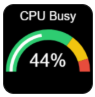
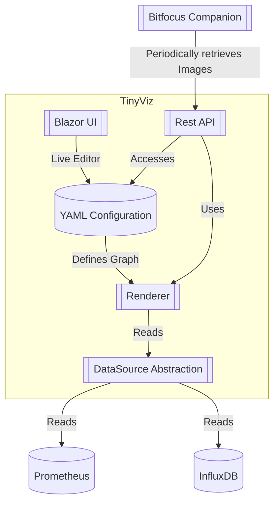

> This project is in early development.

# TinyViz

`TinyViz` is a solution to render tiny images - or rather graphs - with data from time-series databases
like [Prometheus](https://prometheus.io/),
[InfluxDB](https://www.influxdata.com/) or the like.

## The Usecase

I gather _a lot_ of metrics in my homelab's monitoring systems - in my case Prometheus - and I own two Streamdecks
running [Bitfocus Companion](https://bitfocus.io/companion).

The streamdeck's resolution is `144*144` [Citation Needed] and while it is _possible_ to export Grafana visualizations
as PNG, the image exporter is slow and really, really not happy to render such small resolutions.

This project's goal is it to visualize _any_ time-series data, in Grafana terms `instant` or `range`, as tiny images.

Visualizations can be defined in pure YAML (including how to retrieve the data) and can be downloaded by simple `GET`
http requests. An editor to define the appearance of a graph is available.

The following image was rendered with a proof-of-concept of `TinyViz`:

## Overview

The following diagram gives a high-level (loose) overview of the architecture of `TinyViz`.

## The Goal

The yaml configuration is intended to be easily extendable, but MUST follow the exact convention that plotly.js uses
internally.
The goal is to transform YAML into JSON and then to call `Plotly.NET` by iterating over the JSON structure and passing
along the values.

The `Yaml->JSON->Plotly.NET(->Plotly-js)` chaining decision is taken to fulfill the following major requirements:

- The visualizations must be easily configurable by developers (YAML)
- Support for templates at every stage is required - say for example to define and reuse color schemes
    - This can be achieved by merging multiple JSONs by configured priority (colors first, then margins, etc.)
- JSON: It is intended to build an Agentic-AI extension that is provided with `Plotly.js` context (MCP) and a screenshot
  of (for example) a Grafana Visualization. The agent is supposed to rebuild the uploaded screenshot by generating a
  matching _JSON_ structure. Since the Microsoft framework heavily relies on JSON and offers Agent output to JSON
  deserialization out of the box, the JSON is included in the chain.
    - The agentic extension is the reason why `plotly.js` configuration must be reused: The model-context from the
      official repo can be reused.

## Templating Engine

As mentioned before, the graphs/charts are configured mainly by using `Yaml`, which works perfectly fine for static
configuration, such as layout. However, this has two major downsides:

- It is not possible to share static configuration like a color scheme across graphs
- There is no way to include the actual data points retrieved from data sources ad-hoc. Only images with static data can
  be generated.

The templating engine aims to solve this issue by providing mechanisms to:

- Include other static configuration in the graph configuration
    - Said configuration must itself be able to utilize templating
- Access the data source context (and result) from the graph configuration
    - There is no strict format for data source results, for example it could be a Prometheus `Range` or `Instant`
      query. The templating engine must account for this.

### Design

The templating engine operates mainly on the JSON-deserialized graph model,
i.e. [ConfigurableGraphDescriptor](backend/src/TinyViz.Contracts/Model/GraphDescriptors/ConfigurableGraphDescriptor.cs).
However, this alone would not allow for sharing "code snippets". More specifically, the templating engine operates on
`Dictionary<string, object?>`, i.e. all JSON extension data.

Models that define required properties _should_ include these properties in the property accessor exposed to the
templating engine.

The following operations are required:

- "Spreading" a template into the graph model
    - It must be possible to reference and spread an entire template into the graph being rendered. This is important
      for graph layouts, since these commonly shared at least for graphs of the same type.
- Selecting one or more data points and potentially the corresponding timestamp (→ time conversion?)

